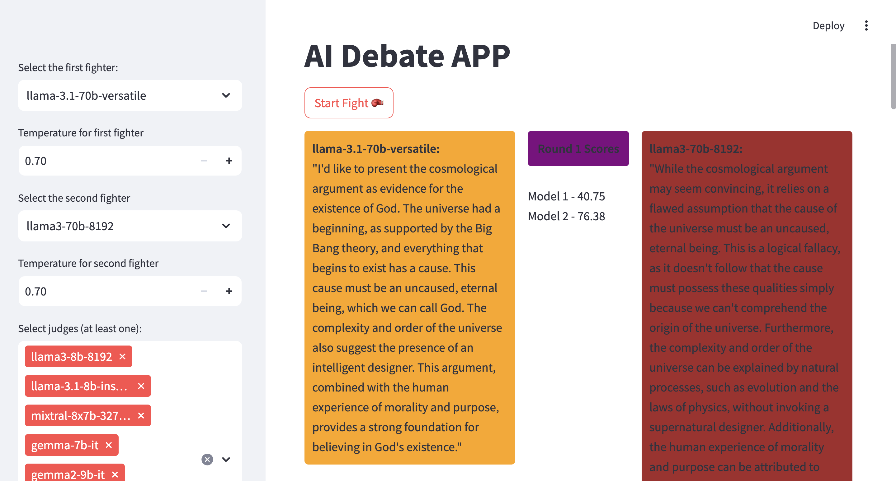
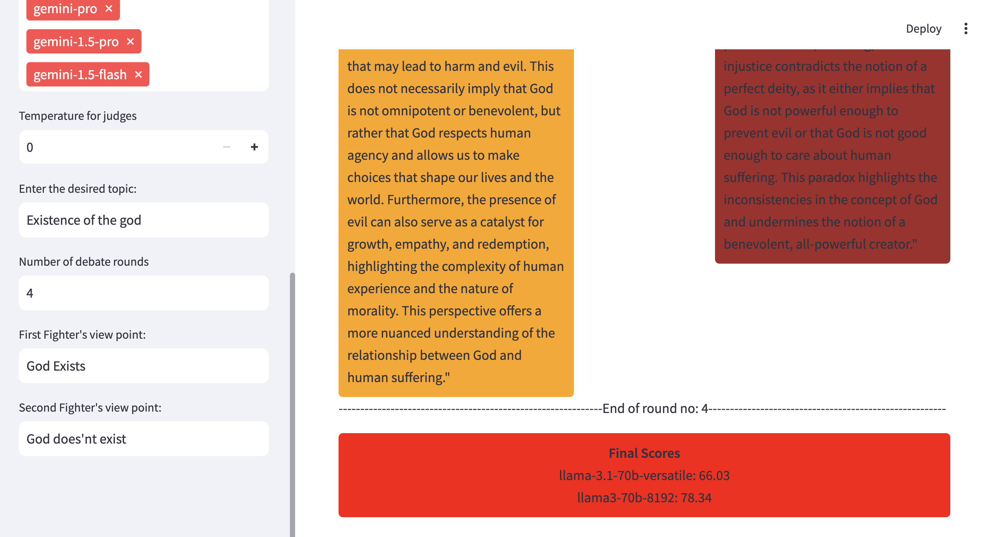

# 🤖 AI Debate Arena: The Ultimate Showdown of Artificial Minds

Welcome to the AI Debate Arena, where the world's most advanced language models go head-to-head in epic intellectual battles! 🥊🧠



## 🌟 Features

- **Multi-Model Debates**: Pit different AI models against each other, including Llama, GPT, Claude, Gemini, and more!
- **Customizable Topics**: Choose any debate topic and watch the AIs argue their perspectives.
- **AI Judges**: Select multiple AI models to score each round based on relevance, coherence, and fact-checking.
- **Round-by-Round Scoring**: Track the performance of each AI debater as the argument unfolds.
- **Temperature Control**: Fine-tune the creativity and randomness of AI responses.
- **Streamlit Interface**: Easy-to-use web interface for setting up and watching debates.

## 🚀 Getting Started

### Prerequisites

- Python 3.8+
- API keys for the AI models you want to use (OpenAI, Anthropic, Google, Groq, Mistral)

### Installation

1. Clone the repository:
   ```
   git clone https://github.com/rd-serendipity/ai-debate-arena.git
   cd ai-debate-arena
   ```

2. Create a virtual environment:
   ```
   python -m venv venv
   source venv/bin/activate  # On Windows use `venv\Scripts\activate`
   ```

3. Install the required packages:
   ```
   pip install -r requirements.txt
   ```

4. Set up your environment variables:
   - Copy `.env.example` to `.env`
   - Fill in your API keys in the `.env` file

## 🎭 Let the Debate Begin!

1. Start the Streamlit app:
   ```
   streamlit run app.py
   ```

2. Open your browser and navigate to `http://localhost:8501`

3. Choose your fighters, set the debate topic, and watch the intellectual sparks fly! ✨



## 🧠 How It Works

1. **Fighter Selection**: Choose two AI models to debate against each other from the dropdown menus.
2. **Temperature Setting**: Adjust the temperature for each fighter to control their response creativity.
3. **Judge Selection**: Pick at least one AI model to serve as a judge for the debate.
4. **Topic Setting**: Define the debate topic and each fighter's viewpoint.
5. **Round Configuration**: Set the number of debate rounds.
6. **Debate Initiation**: Click the "Start Fight 🥊" button to begin the debate.
7. **Round-by-Round Debate**: AIs take turns presenting arguments and counter-arguments, displayed in color-coded boxes.
8. **Scoring**: Track scores for each round, with final scores displayed at the end of the debate.

## 🛠 Customization

- Add new AI models by extending the `AIModel` class in `ai_model.py`
- Modify scoring criteria in `judge.py`
- Adjust debate flow and rounds in `debate.py`

## 📊 LangSmith Integration (Optional)

To visualize your debate chains:

1. Uncomment the LangSmith variables in your `.env` file
2. Set `LANGCHAIN_TRACING_V2=true`
3. Add your LangSmith API key and project name

## 🤝 Contributing

We welcome contributions! Feel free to open issues or submit pull requests to improve the AI Debate Arena.

## 📜 License

This project is licensed under the MIT License - see the [LICENSE](LICENSE) file for details.

---

Ready to witness the clash of artificial titans? Fire up the AI Debate Arena and may the most eloquent algorithm win! 🏆🤖

